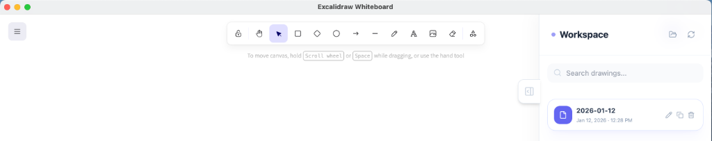

# Excalidraw Desktop
Unofficial desktop client for Excalidraw on Windows & MacOS. This version has been significantly enhanced to provide a robust local-first experience with a modern UI.



## Key Features

- **🚀 Integrated Local Workspace**: Manage all your `.excalidraw` files directly within the app using the new right-hand sidebar.
- **✨ Modern UI/UX**: Overhauled interface using **Tailwind CSS** and **Lucide Icons** for a premium, desktop-native feel.
- **💾 Native File Interception**: Clicking "Save to disk" in Excalidraw now automatically saves files to your `~/Documents/Excalidraw-Desktop` folder without annoying system dialogs.
- **🔄 Smart Workspace Sync**:
  - **Inline Renaming**: Change file names directly in the sidebar; the app internal state syncs automatically.
  - **File Duplication**: Quickly create copies of your drawings with one click.
  - **Auto-Save**: Background saving every 15 seconds ensuring your progress is never lost.
- **🔔 Real-time Feedback**: **Toast notifications** for all operations (Save, Rename, Copy, Delete).
- **⌨️ Pro Shortcuts**: Support for **Ctrl/Cmd + S** to instantly save to your local workspace.
- **🔍 Fast Search**: Filter your drawings instantly as you type.
- **📂 One-Click Finder**: Access your local drawing folder in system file explorer directly from the sidebar.

# Installation
Head over to the [releases page](https://github.com/pgkt04/excalidraw-desktop/releases/). Follow these steps:
1. Visit the [Releases](https://github.com/pgkt04/excalidraw-desktop/releases/) page.
2. Download the appropriate installer for your operating system:
3. Once downloaded, run the installer and follow the on-screen instructions to install the Excalidraw desktop client.

## MacOS Users
If you get the error "Is Damaged and Can’t Be Opened. You Should Move It To The Bin".  
You can run the command:
```bash
xattr -c /Applications/Excalidraw.app
```
This is because I don't have a developer certificate and its not notarized.

# Development or Building
Before building the project, ensure you have the following prerequisites installed on your system:

Prerequisites
Node.js (version 14.x or higher)
npm (comes with Node.js)

### Clone the repository:
```bash
git clone https://github.com/pgkt04/excalidraw-desktop.git
cd excalidraw-desktop
```

### Install the dependencies:
```bash
npm install
```

## Running
Once the dependencies are installed, you can start the application in development mode.

To run the app in development mode:
```bash
npm run start
```

## Building
To create a production build and generate executable installers for both Windows and macOS:

Run the following command:
```bash
npm run dist
```
This will package the application into a distribution format (e.g., .exe for Windows and .dmg for macOS).
The generated installers will be found in the `dist` folder.
